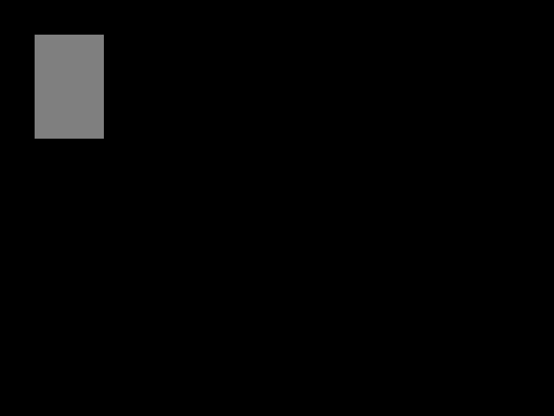
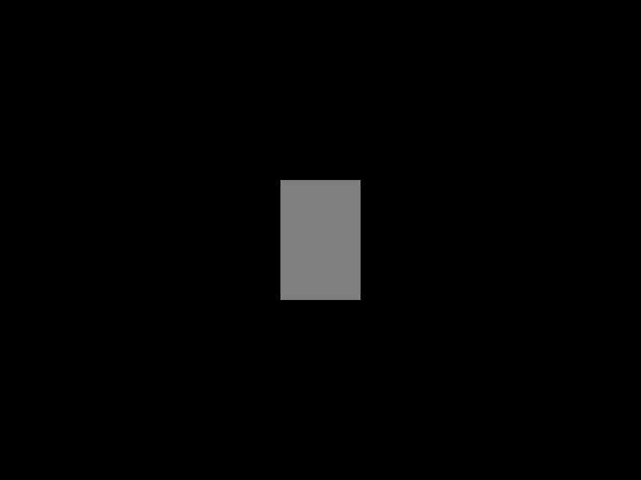
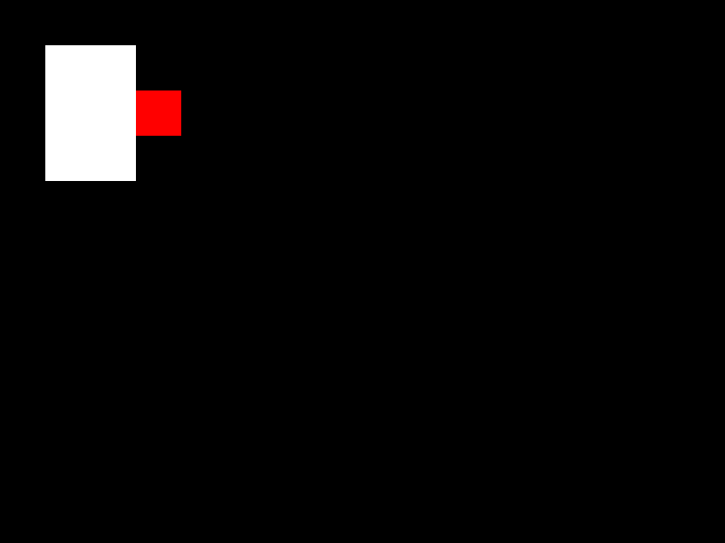
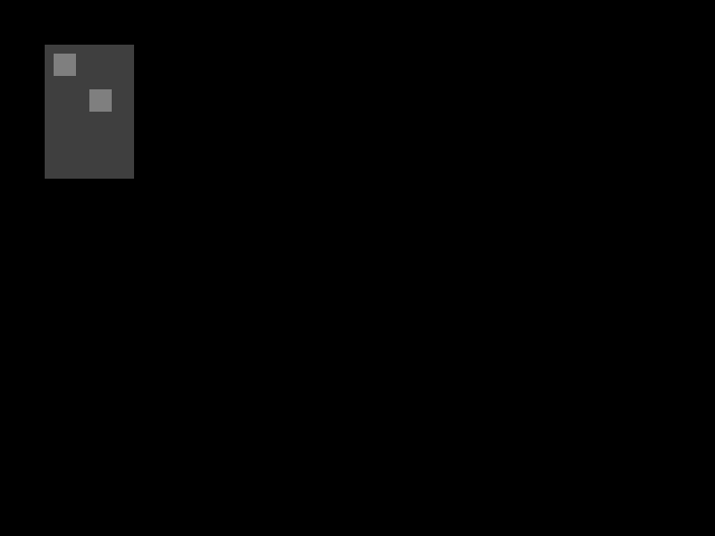
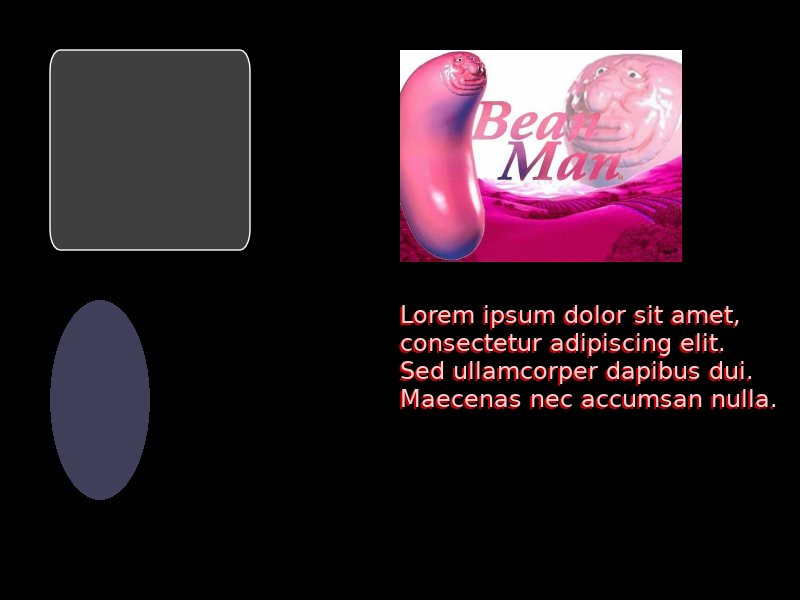

# Basic usage

## Installation
To use Charm, place charm.lua in your project, and then `require` it in each file where you need to use it:

```lua
local charm = require 'charm' -- if your charm.lua is in the root directory
local charm = require 'path.to.charm' -- if it's in subfolders
```

## Drawing elements
To use Charm, first we need to create a layout object.
```lua
local layout = charm.new()
```
This object is responsible for arranging and drawing graphics. In `love.draw`, we tell the layout object what to draw, and once we're done, we call the `draw` function to display those graphics on screen.

This code will draw a grey rectangle on the screen:
```lua
function love.draw()
	layout:new('rectangle', 50, 50, 100, 150)
	layout:fillColor(.5, .5, .5)
	layout:draw()
end
```



- The `new` function defines a new **element**. The first argument is always the type of the element. The arguments after that depend on what type of element we created. For rectangles, we can specify an x position, y position, width and height.
- Functions like `fillColor` set a property on the most recently created element. Which properties are available depends on what element we're modifying. In this case we're specifying a fill color for the rectangle (otherwise it would be invisible).
- The `draw` function tells the layout object that we're done specifying our elements and we can actually display them now.

Most of the layout object's functions return the layout object itself, so we can chain the methods together and write the same code like this:
```lua
function love.draw()
	layout
		:new('rectangle', 50, 50, 100, 150)
			:fillColor(.5, .5, .5)
		:draw()
end
```
You don't have to use method chaining, I just think it looks nice.

## Position functions
Instead of passing the dimensions of the rectangle to the `new` function, you can use the position and size functions.
```lua
function love.draw()
	layout
		:new 'rectangle'
			:x(50)
			:y(50)
			:width(100)
			:height(150)
			:fillColor(.5, .5, .5)
		:draw()
end
```
This gives you more control over the position of the element, because you can pass a second argument to `x` and `y` representing the **origin**.

The origin determines which part of the rectangle you're setting to a certain position. For the `x` function, an origin of 0 represents the left edge of the rectangle, 1 represents the right edge, and 0.5 represents the center. You can also use any number in between. Similarly, for the `y` function, 0 represents the top and 1 represents the bottom.

This code will draw the rectangle in the center of the screen:
```lua
function love.draw()
	layout
		:new 'rectangle'
			:x(love.graphics.getWidth() / 2, .5)
			:y(love.graphics.getHeight() / 2, .5)
			:width(100)
			:height(150)
			:fillColor(.5, .5, .5)
		:draw()
end
```



Since it's common to set the position of the edges or center of the rectangle, there are shortcut functions for that: `left`, `centerX`, `right`, `top`, `centerY`, and `bottom`.
```lua
function love.draw()
	layout
		:new 'rectangle'
			:centerX(love.graphics.getWidth() / 2)
			:centerY(love.graphics.getHeight() / 2)
			:size(100, 150) -- this function sets both the width and height
			:fillColor(.5, .5, .5)
		:draw()
end
```

## Positioning elements relative to each other
Once we define an element, we can get any point along the x or y axis using `layout.get`. This code displays a white rectangle and a red rectangle that's 50 pixels to the right of the white rectangle and vertically aligned:
```lua
function love.draw()
	layout
		:new('rectangle', 50, 50, 100, 150)
			:name 'eleanor'
			:fillColor(1, 1, 1)
		:new 'rectangle'
			:size(50, 50)
			:left(layout:get('eleanor', 'x', 1))
			:centerY(layout:get('eleanor', 'y', .5))
			:fillColor(1, 0, 0)
		:draw()
end
```



We give the first rectangle a name using the `name` function. The name of the element is completely arbitrary. Then, we can get information about the element using `layout.get`:
- The first argument is the name of the element to get
- The second argument is the name of the property to get
- The following arguments have a different purpose depending on the property. In this case, the next argument is the origin, just like when we set positions of elements.

## Grouping elements together
Any element can have any number of **child elements**. We can assign elements to a parent by placing them between a `beginChildren` and an `endChildren` call.
```lua
function love.draw()
	layout
		:new('rectangle', 50, 50, 100, 150)
			:beginChildren()
				:new('rectangle', 10, 10, 25, 25)
					:fillColor(1/2, 1/2, 1/2)
				:new('rectangle', 50, 50, 25, 25)
					:fillColor(1/2, 1/2, 1/2)
			:endChildren()
			:fillColor(1/4, 1/4, 1/4)
		:draw()
end
```



Child elements are positioned relative to their parent, so in this example, the two child rectangles would appear on screen at (60, 60) and (100, 100) respectively.

Sometimes you might want to position multiple elements as a single group. Charm provides a `wrap` function which adjusts the dimensions of a parent element to perfectly surround all its child elements. Then the parent element can be positioned, which moves the children as well. The following code will create two rectangles and center them both on screen as a group.
```lua
function love.draw()
	layout
		:new 'rectangle'
			:beginChildren()
				:new('rectangle', 0, 0, 100, 100)
					:fillColor(1/2, 1/2, 1/2)
				:new('rectangle', 110, 0, 100, 100)
					:fillColor(1/2, 1/2, 1/2)
			:endChildren()
			:wrap()
			:center(love.graphics.getWidth()/2)
			:middle(love.graphics.getHeight()/2)
		:draw()
end
```


## Element selectors
Rather than using the names of an element to get information about it, we can use special keywords to select an element without having to give it a name first. Charm provides three keywords:
- `@current` - the element currently being modified
- `@previous` - the previously selected element
- `@parent` - the parent of the currently modified element

Here's a modified version of the above example that uses `@previous`, the most commonly useful keyword:
```lua
function love.draw()
	layout
		:new 'rectangle'
			:width(100)
			:beginChildren()
				:new('rectangle', 0, 0, 100, 100)
					:fillColor(1/2, 1/2, 1/2)
				:new 'rectangle'
					:left(layout:get('@previous', 'right') + 10)
					:y(0)
					:size(100, 100)
					:fillColor(1/2, 1/2, 1/2)
			:endChildren()
			:wrap()
			:centerX(love.graphics.getWidth()/2)
			:centerY(love.graphics.getHeight()/2)
		:draw()
end
```

## Drawing things other than rectangles
Of course, you can use Charm for things other than rectangles. Here's an example of some of the other elements Charm has built-in:
```lua
local beanMan = love.graphics.newImage 'bean man.jpg'
local font = love.graphics.newFont(24)
local layout = require 'charm'.new()
local text = [[Lorem ipsum dolor sit amet,
consectetur adipiscing elit.
Sed ullamcorper dapibus dui.
Maecenas nec accumsan nulla.]]

function love.draw()
	layout
		-- rectangle with an outline and rounded corners
		:new('rectangle', 50, 50, 200, 200)
			:fillColor(.25, .25, .25)
			:outlineColor(1, 1, 1)
			:cornerRadius(10, 20)
		-- ellipse
		:new('ellipse', 50, 300, 100, 200)
			:fillColor(.25, .25, .35)
		-- images
		:new('image', beanMan, 400, 50)
			:scale(.5)
		-- text with shadow
		:new('text', font, text, 400, 300)
			:color(1, .8, .8)
			:shadowColor(.8, 0, 0)
			:shadowOffset(-2, 2)
		:draw()
end
```



For more info on how to use these, see the [API](https://tesselode.github.io/charm/).
